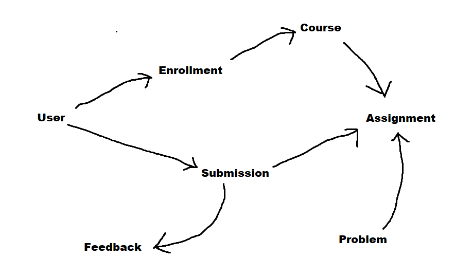

# Data Model Diagram

## Core nouns
- User: represents students, instructors, and admins
- Course: contains assignments and enrollments
- Enrollment: A user joins a course with a role
- Assignment: tasks contained in a course
- Submission: a student's attempt at an assignment
- Feedback: grade and/or comments attached to a submission by an instructor
- Problem: Questions contained in an assignment of multiple choice, short answer, or graph types

## Relationships
- A User can Enroll in many Courses
- A Course has many Assignments
- An Assignment can have many Problems
- A User may make many Submissions to an Assignment
- A submission receives Feedback

